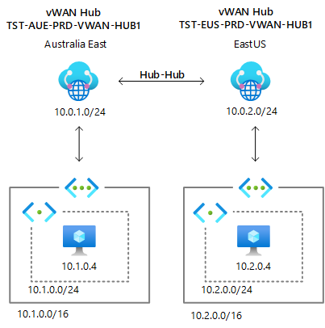
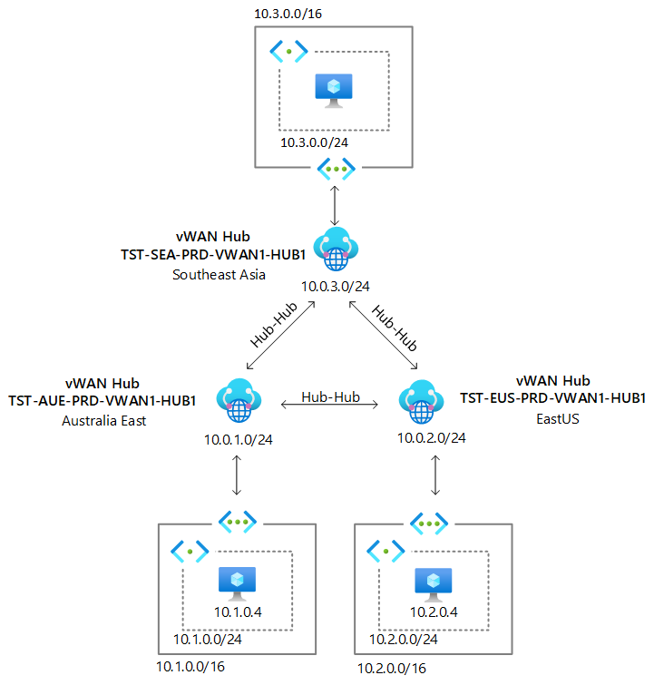

# Azure Virtual VWAN - N Region Lab Setup

This [Bicep](https://github.com/Azure/bicep) template will provision a lab environment that demonstrate features and capabilities of Azure Virtual WAN (VWAN). The template will provision VWAN resource and N number of regional hubs. Moreover, it will create a spoke VNet for each hub region and connect it to the VWAN Hub in the respective region. Each VNet will also encompass a VM created within a VNet.

The template is a deployed at the subscription level and it creates multiple resource group. The template uses nested deployments using bicep modules. 

This page provides information around how this Bicep Template can be used with examples. 

## Example 1 - Azure VWAN 2 Region setup - Contoso

This example provisions a setup with 2 VWAN Hubs including a VNET and VM in each region. The final solution after deployment will look like below. 



The two region setup can be provisioned using the [vwansubdeploy.parameters.json](/vwansubdeploy.parameters.json) file. An example deployment will look like below. 

```powershell
az deployment sub create -f .\template\n_vwan_deployment.bicep -p .\template\n_vwan_deployment.parameters.2region.json -l australiaeast -c -o json
```

## Example 2 - Azure VWAN 3 Region Setup - Fabrikam

This example provisions a setup with 3 VWAN hubs similar to above. The final solution after deployment will like below. 



The three region setup can be provisioned using the [vwansubdeploy-3.parameters.json](/vwansubdeploy-3.parameters.json) file. An example deployment will look like below. 

```powershell
az deployment sub create -f .\template\n_vwan_deployment.bicep -p .\template\n_vwan_deployment.parameters.3region.json -l australiaeast -c -o json
```


